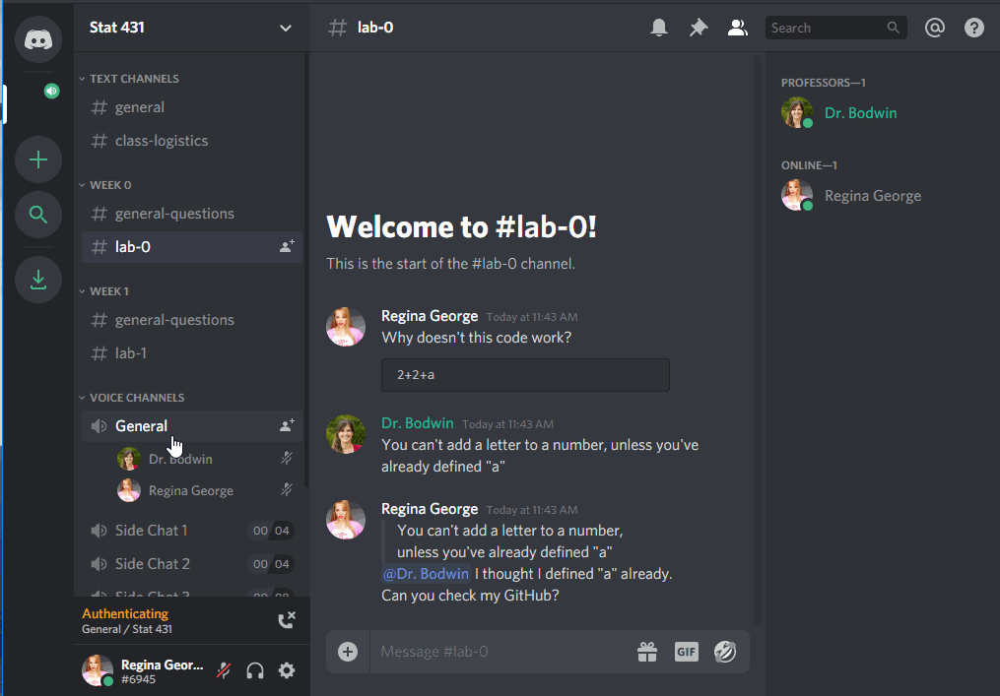

```{r setup, include=FALSE}
knitr::opts_chunk$set(echo = TRUE)
options("couRsework-img_path" = "../../Images/icons") 
### change this if icons local
```

```{r, include = FALSE}
library(tidyverse)
library(couRsework)
library(flair)
```


In lieu of an in-person class, we'll be interacting with each other through an
app called **Discord**.  

Discord is a platform for text chatting, voice chatting, and screen sharing.

In particular, course **office hours** are held via Discord, if you are a **Full Course Subscriber**.  
Your professor will be available for public questions, or one-on-one and small group chats by text, voice, 
or video.

The office hours for this class are:

### Tuesday and Thursday 10am-11am PST

I will often be willing to hop on Discord and help out at other times, and I will
answer text chat questions regularly throughout every day!

---

## Join the server

When you [subscribe to this class on Patreon](https://www.patreon.com/kbodwin), you will be automatically invited to 
the Discord server.

When you enter the server, you will be given some suggestions to get started.  


We recommend you click through these - and in particular, it is probably a good idea to download the desktop version of Discord, and perhaps to install it on your phone if you wish.

---

## Set up your account

### Verify your email

To use this Discord server, you **must** have a verified email.  

Nobody (including your professors) will be able to see this email.  
This is simply to keep the server from being overrun by temporary accounts.


### Create your identity

The first thing you should do is decide what name and picture you would like to use.


We would like to **strongly** encourage you to use your **real name and picture**, 
so that we can get to know you.  However, if you prefer to remain anonymous, 
you are free to do so.


(Please do not be like Regina and use the name of another real person, however!  
This kind of impersonation will result in a permanent ban from the server.)


### Decide about privacy and notifications

The default settings on the channel are probably just fine for you.  
Feel free to make any changes that work for you, though.

You can change your message notifications:


You can edit your privacy settings, although most things are already private:


### Connect other apps

You can connect other apps to Discord, either for productivity or just for fun.


I have connected my Spotify, so you can listen along with my music and/or judge my taste.


---

## Using the Channels

The server is made up of many channels.  Some are text chatrooms, while some are "Voice Channels" that connect you via audio to everyone else in the channel.


### Text Channels

You can ask questions by text in any of the open text channels.  This is primarily to get help and discuss with
your classmates; for the most part, I will not be answering questions in the general channels.  (Although I'll
pop in from time to time!)


Use the `#general` channel for anything and everything:


If your question is about course logistics, rather than the material itself, consider using the `#class-logistics` channel:


You can use the specific weekly channels to ask questions about the material...


... or the specific lab assignment.


Notice that you can use tick marks (` ``` `), like in R Markdown, to make your code appear in a formatted code box.


#### Ask the prof

There is one additional channel each week called `#ask-the-prof`.  This channel is available only to **Full Course** subscribers.

I will regularly answer questions posted in this channel.


### Voice Channels

To join a voice channel, simply click it!  Make sure you are careful about when you are muted or unmuted.



The extra "Side Chat" channels are limited to 2, 4 or 8 people, if you would like to start an impromptu study conversation without being heard by the professors and/or the rest of the class.  (We'll only drop in if you invite us!)

Voice channels can also be used for people to "Go Live", and share their screen with everyone else.


While this will usually be something professors use to demonstrate code, you can go live, too!  This lets others help you troubleshoot your work.  But you may need to download the desktop version of Discord to do so.


### Private messages

It is also easy to send private messages, to your professor(s) or to each other.  These private messages can also easily be used to launch a private video chat and/or screen sharing.


*Note:* Please do **not** private message me, unless you have a concern about your Patreon subscription that involves personal information.  All other questions should be posted in the public channels.

---

## Creating your own server

Last but not least - if you have an established study group you like to work with, and you want to use Discord to communicate without the distraction or invasion of the rest of the class, feel free to create your very own server!  You can easily hop between servers during work parties, to ask each other questions or just to take a break and chat about life.


---

## See you "in class"!


---

```{r, results = "asis", echo = FALSE}
checkin("Discord Server")
```

Introduce yourself in the "Introductions" channel of the Discord Server.

---