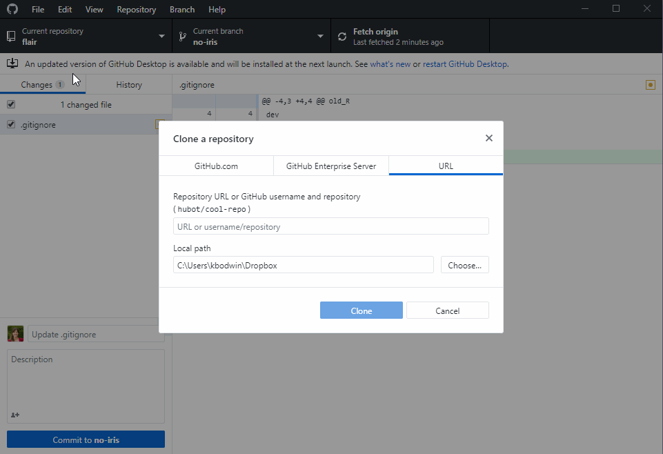
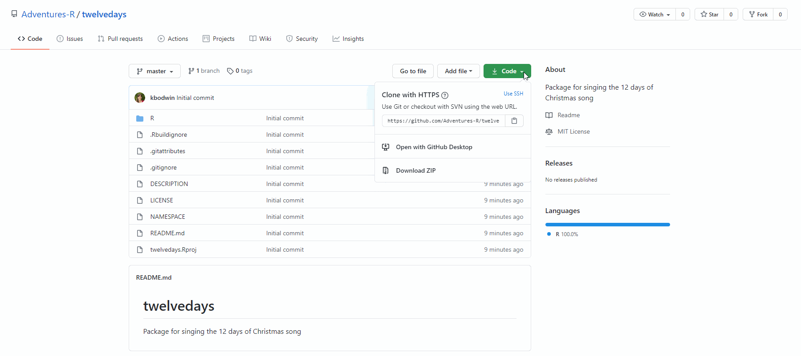

```{r setup, include=FALSE}
knitr::opts_chunk$set(echo = TRUE, eval = FALSE)

library(tidyverse)
```

## Introduction

The song "12 Days of Christmas", written around 1780, tells the tale of many gifts 
a person receives in the days leading up to Christmas. ([https://en.wikipedia.org/wiki/The_Twelve_Days_of_Christmas_(song)](https://en.wikipedia.org/wiki/The_Twelve_Days_of_Christmas_(song))) 

These gifts repeat and compound; on the first day, the narrator recieves

```
A partridge in a pear tree.
```

On the last day, he or she receives

```
Twelve Drummers Drumming
Eleven Pipers Piping
Ten Lords a Leaping
Nine Ladies Waiting
Eight Maids a Milking
Seven Swans a Swimming
Six Geese a Laying
Five Golden Rings
Four Calling Birds
Three French Hens
Two Turtle Doves
And a Partridge in a Pear Tree
```

Your task will be to help write a package that automatically sings this very
repetitive song.

---

## The Package

A package has been created for you at https://github.com/Adventures-R/twelvedays

Alas, the functions in the package are not complete.  Your job is to fill out the
rest of the code inside the functions.

You can copy this package to your computer through GitHub Desktop...



...or by downloading the package folder directly from online:



Once you have downloaded the folder, double-click the `.Rproj` file inside to
launch your R Project.

### A Test Dataset

Run the code below to load up a dataset called `xmas` that contains the crucial 
information about the gifts in the song. We will use this dataset to test out
our functions as we work on them.

```{r}
xmas <- read.csv("https://www.dropbox.com/s/e584pryn8evm1gz/xmas.csv?dl=1")
```

Note that your functions can - and should! - reference each other.  
That is, don't duplicate code; use earlier, smaller functions inside your larger 
functions.

### Other packages

The packages `dplyr`, `stringr`, `glue`, and `purrr` are already imported into
the `twelvedays` package, so you can use functions from these without worrying.

If you want to rely on functions from other packages that's fine, but you need to do
the following:

1.  Type `usethis::use_package("packagename")` into the **console**.
2.  Add `@import packagename` in the top section of each `.R` file.

---

## Step One:  Plurals

Note that the gifts are listed in singular: for example, on day 5 the narrator 
receives "5 golden rings", but the entry in the dataset for the gift on day 5 
simply says "ring".  

In your `twelvedays` package, navigate to the file `pluralize_gift.R` in the `R` 
folder. You will find some incomplete code for a function called `pluralize_gift` 
that takes a gift and returns the appropriate plural. 

Complete this function code.

Try your function out on the gifts in the dataset.  
(Consider: is your function *vectorized*?  
It does not have to be, but it may make things simpler!)

```{r}

pluralize_gift(xmas$Gift.Item)

purrr::map_chr(xmas$Gift.Item, pluralize_gift)

```

*Hint 1:* Note that the gifts on days 6 and 9 have unusual pluralizations.  You 
may assume that in other datasets, there will be no special cases besides these types.

*Hint 2:*  The following small example may be useful to you:

```{r, eval = TRUE}
my_names <- c("Kimberly", "Trini", "Jason", "Billy", "Zach", "Tommy")

my_names %>% 
  str_replace("y$", "ies")
```


**Important:**  You should **absolutely not** "hard-code" anything into this 
function; this function should work in general, not just for the items in the 12 
Days of Christmas.  For example, the word "rings" should not appear anywhere in 
the function.  I should be able to give it any gift and any day, and get back the 
plural.


---


## Step Two: Creating sentences

Write a function called `make_phrase` that takes as input the necessary information, 
and returns a phrase.  For example, 

```{r}
make_phrase(num = 10, 
            num_word = "ten", 
            item = "lords", 
            verb = "a-leaping", 
            adjective = "", 
            location = "")
```

should return

```
"ten lords a-leaping"
```

Try your function out on the `xmas` data, by making a new variable containing the daily phrases.

```{r}
xmas %>%
  mutate(
    Full.Phrase = pmap...
  )
```

---


## Step Three:  Iteration.

Write a function called `sing_line` that takes as input:

* A dataset

* A number indicating which day to sing about

* The name of a column in the dataset that contains the phrases for each day.


For example,


```{r}
sing_line(xmas, 2, Full.Phrase)

```

should return

```
On the second day of Christmas, my true love sent to me,
two turtle doves 
and a partridge in a pear tree.
```

*Hint:* This function will need a `map` function inside of it, to iterate over 
all the gifts that are given on a particular day.

*Hint 2:*  The `{{phrase_col}}` part, which I provided for you, lets you use 
column names as arguments to a function.  Don't delete that line of code!

---

## Step Four: Use your package.


#### Get it on GitHub

Once you are done with all the functions, make sure you have **pushed** your work
to GitHub.

#### Install the package

In your console, type 

```{r}
remotes::install_github("yourname/twelvedays")
```

#### Load the package

Create a new R Markdown file. At the top, include:

```{r}
library(twelvedays)
```

Also include a url to your GitHub repository.


#### Try the package

Use the following code to load a dataset that is different from the original
`xmas` song. 

```{r, echo = TRUE}
xmas2 <- read.csv("https://www.dropbox.com/s/ap2hqssese1ki4j/xmas_2.csv?dl=1")

```

Use the functions from your package to print out the whole song from the `xmas2`
dataset.

Knit your html, and turn it in.

---

## Grading

Major points will be deducted for:

* A package that cannot be installed

* Functions that do not work the way they are intended

* "Hard-Coding" in functions.

* Not using `map` or `apply` for iteration.

* Not singing the full song.  Remember, each day, you get the gift for that day
*and* all the prior days.


Minor points will be deducted for:

* Song output that displays in unappealing ways (e.g. extraneous output, extra white
space, etc.)

* Minor warning messages from functions

* Forgetting to include the url to your GitHub repo


No points will be deducted for:

* Unvectorized functions

* Anything to do with the package files, apart from the functions themselves.

---

## Challenge

Add a **unit test** to your package.

[This blog post](https://kbroman.org/pkg_primer/pages/tests.html) should help you
get started.

Create at least one unit test for each of your three functions.

---


